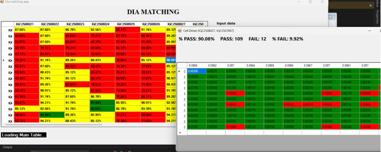

# A C# WinForms project
This repository contains the source code and files for my "diamatching" app. I built this C# application by using WinForms-based user interface (.NET framework) in Visual Code.
# Description
In the semiconductor manufacturing company, Plug (outer diameter size) and Ceramic (inner diameter size) should have their best suitable matching diameter size together to form into a completed semiconductor product. 
Before coming to manufacturing process, we should determine their best suitable match in size (inch), usually presented as the matching percent, which helps not only increase accuracy in physical structure of products, but also enhance performance of electrical characteristics of products while testing.
Thus, I built this simple C# WinForms app as a testing solution. With the input raw data Excel file (this file is provided information about 11 samples of size, from every PLug Lot and Ceramic Lot), 
software app auto-calculate the potiential matching. Depending on specific threshold, the capabilities of each case are sorted as Pass and Fail percent, then visualize all informations in data board for users.

# Technologies used 
1. Windows Forms App (.NET framework).
2. C# programming language in Visual Studio.
3. Library used: EPPLus for access to file Excel.
# Features
Name app: die matching app
1. Input data: browse to find targeted Excel file directory.
2. Output data: browse anywhere to save the generated Excel file
3. Processed output data: show the directory path of the generated Excel file which are going to load
4. Load data table: visualize information into data table
